# Light Bender - Development Journal

Light Bender began as a small Godot movement prototype and slowly turned into a
puzzle platformer about one simple rule: light makes the world usable.

That rule ended up shaping almost everything. The player only trusts platforms
that exist in light, switches can stop working in darkness, batteries become
portable islands of safety, and doors mark the rhythm between one room and the
next. This journal follows the important steps that got the project there.

## The Game Today

| Part | What it adds |
| --- | --- |
| Movement | A responsive platformer controller with dash, wall movement, double jump, slow fall, coyote time, jump buffering, squash/stretch, and dash trails. |
| Light system | Polygon-based light zones cut through the dark overlay and decide which objects can be used. |
| Puzzle objects | Batteries, flashlights, switches, button boxes, doors, hazards, and pickup/drop interactions. |
| Level flow | A reusable base level, checkpoint respawn, circular transitions, saved progress, and a Chapter 1 level selector. |
| Presentation | Pixel UI, menu/pause screens, procedural backgrounds, music pitch changes, SFX, and custom UI sounds. |

## Architecture

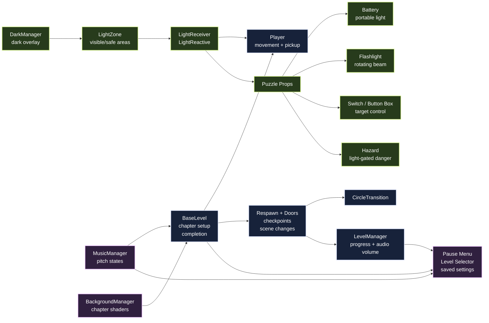

## Visual Progress

The first milestone was not the light mechanic, but the player. Before building
puzzles, we wanted the character to feel pleasant to control. The movement
script was tuned with small forgiveness techniques: coyote time so the player
can still jump just after leaving a ledge, buffered input so a jump pressed a
little early still happens, variable jump height, air control, dash, and a
squash/stretch effect that makes landings and jumps feel more alive.

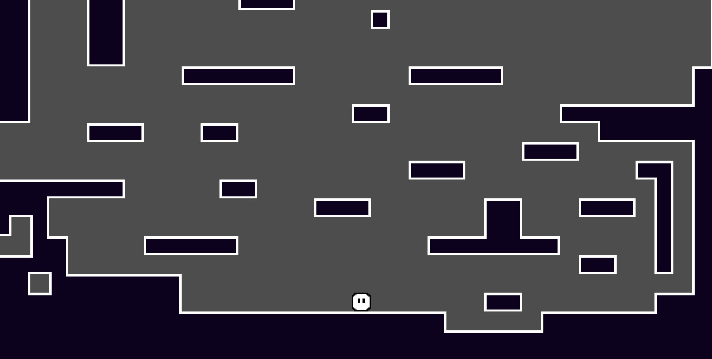

After the player felt good enough to move around with, we started testing the
light idea. The first prototype was simple, but it proved that the mechanic
worked: the lit area could be treated as the active part of the world, while
darkness changed how the player and objects behaved. This was the moment where
the project stopped being only a platformer test and started becoming Light
Bender.

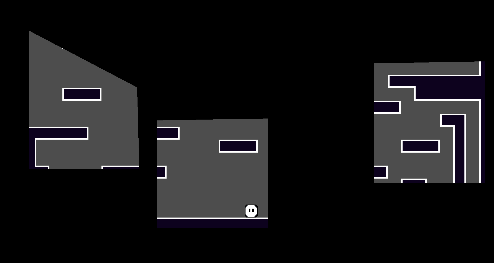

Once we had several rooms, opening them manually from the editor was no longer
comfortable. We added a simple level selector that builds its graph from the
level list in `LevelManager`. That means the selector is not hand-drawn for one
specific layout; it reads the available levels, places them in the chapter graph,
and shows whether each room is locked, unlocked, or completed.

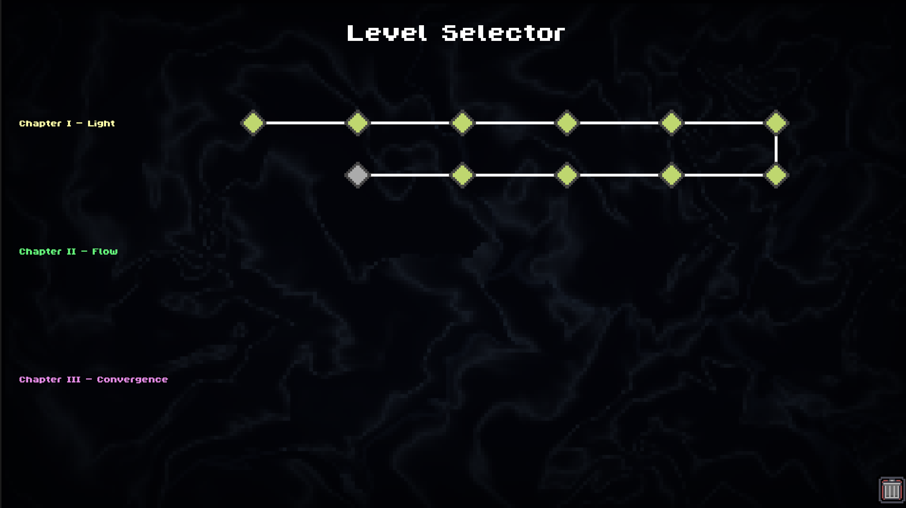

We also built a menu screen using the same pixel UI style. It is useful both in
the level selector and during gameplay: the player can pause, resume, go back to
the level selector, and change music/SFX volume without leaving the game.

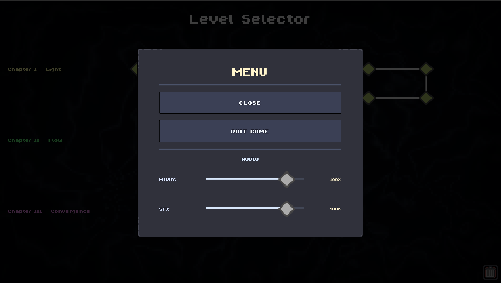

Inside a level, the presentation stays simple and readable: the player, the
door, the platform outline, and the light volume all have clear roles.

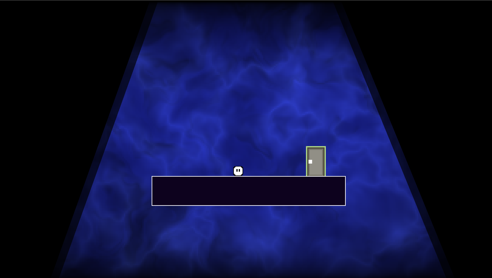

The background also became part of the identity of the game. We added procedural
shader backgrounds instead of a flat color. There are separate shaders for the
three planned chapters, plus a menu background shader. Chapter 1 uses a blue,
fluid look; Chapter 2 moves toward sharper cyan cell-like shapes; Chapter 3 uses
larger magenta blobs. The idea is that each chapter can feel different without
changing the whole visual language of the game.

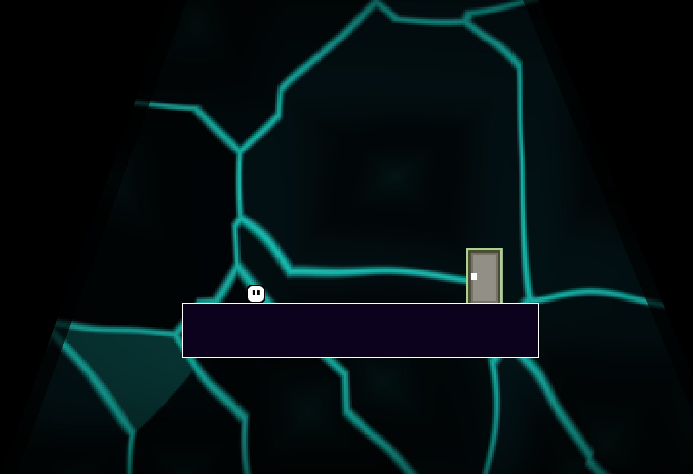

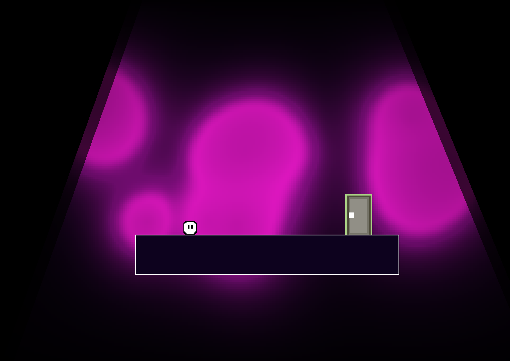

To make deaths and level changes feel smoother, we added a circular transition
effect. It closes around the player or the target door, hides the scene change
or respawn, then opens again. The same transition is used for deaths, level
entry, level exits, and menu navigation, so the game feels less abrupt.

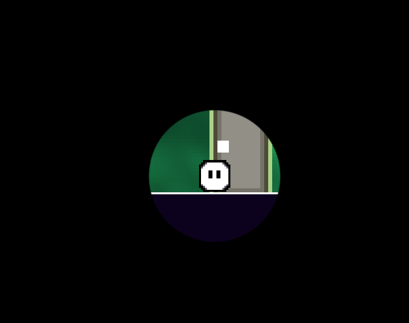

After that, we started adding light objects. The mechanic we chose is that the
player can absorb certain objects, carry them around, and drop them somewhere
else. The important part is that the object keeps its properties while carried:
a battery still emits light, a flashlight still has its beam direction, and the
object still behaves like a solid body when placed back into the level. This
lets the player move puzzle pieces around and even use some of them like small
platforms.

The battery is the clearest example. It charges in light, then becomes a
portable light source that can be carried into dark spaces.

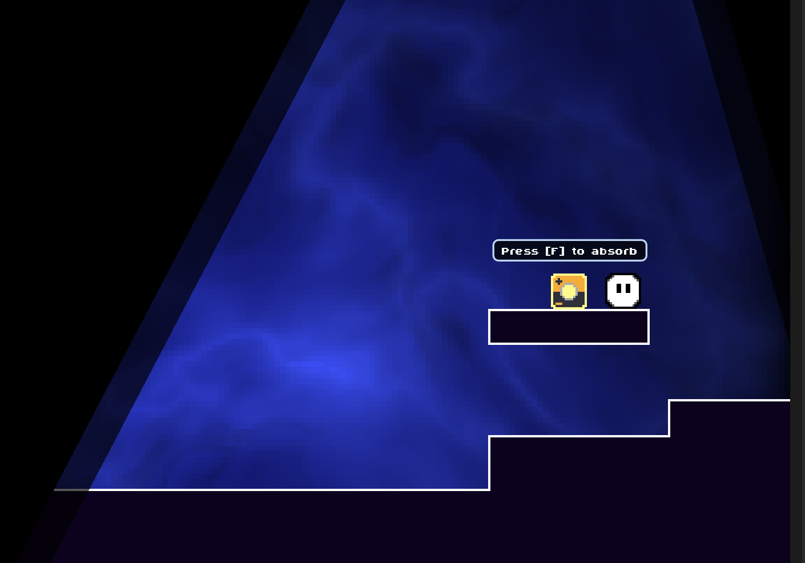

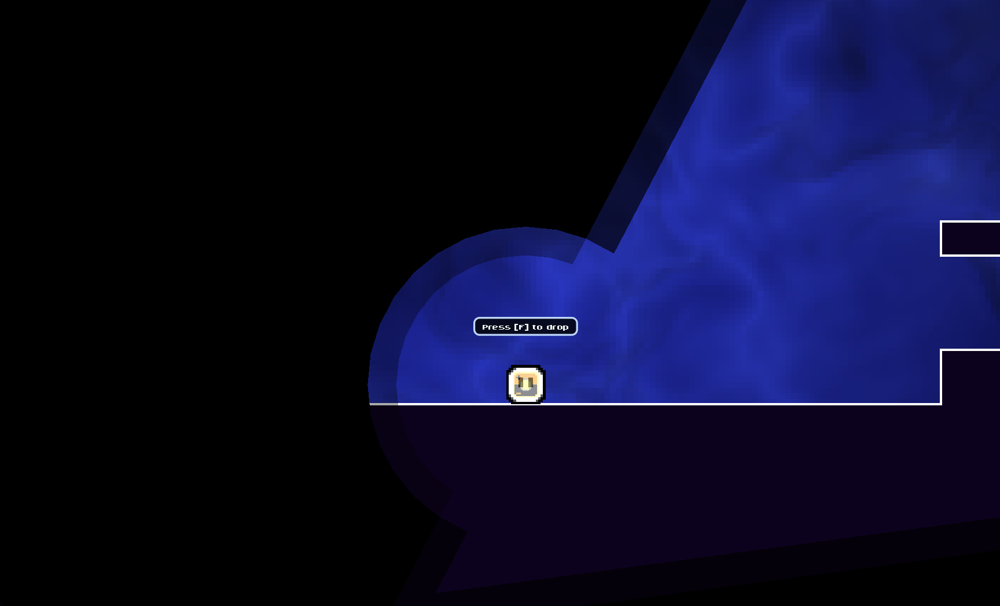

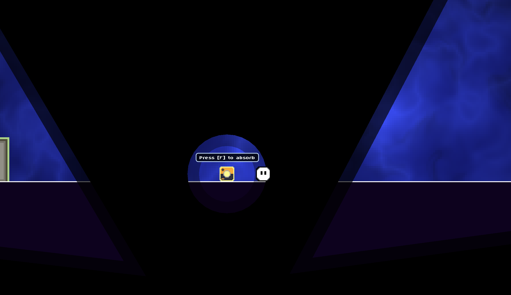

The flashlight is a more directional version of the same idea. It can be picked
up, rotated, moved into another part of the room, and used to aim light into
places that would otherwise stay dark.

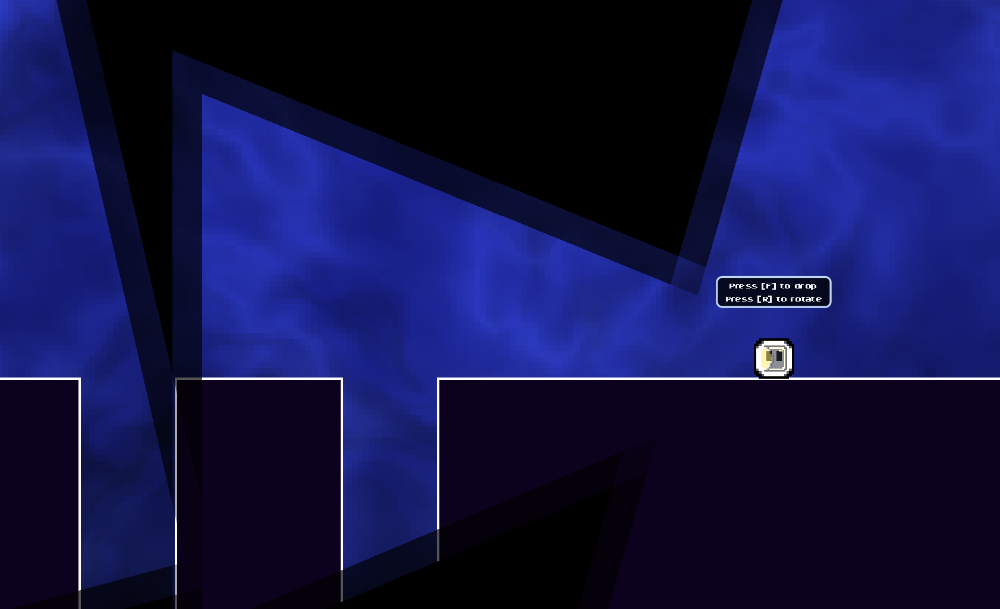

Switches complete the puzzle loop. They allow the player to turn different light
sections on or off, which changes the shape of the usable world. A switch can
make a path appear, remove another one, or open the route to a door, depending
on what light zones it controls.

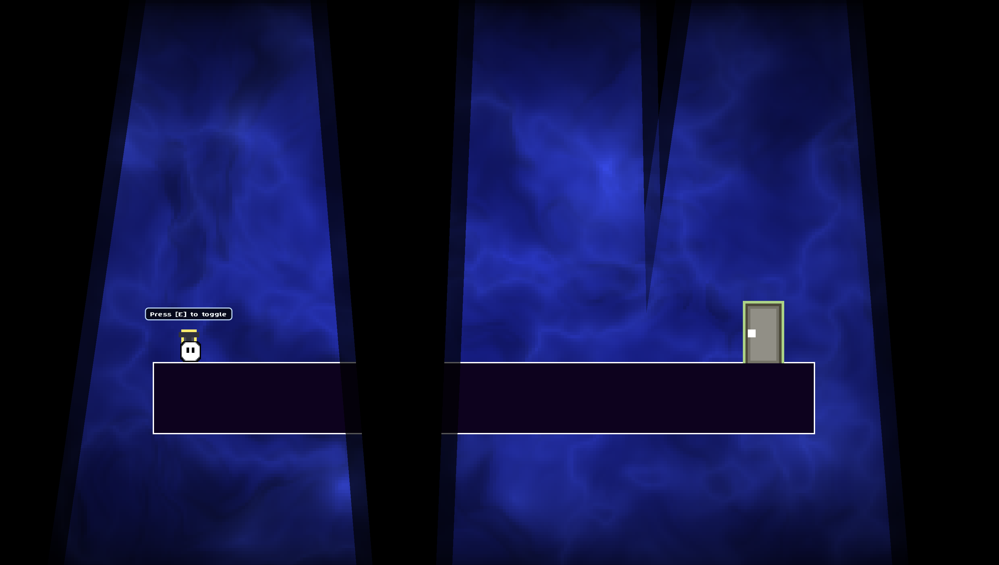

Chapter 1 also started to use larger layouts, with platforming routes, moving
safe areas, and rooms that ask the player to move light around instead of only
moving the character.

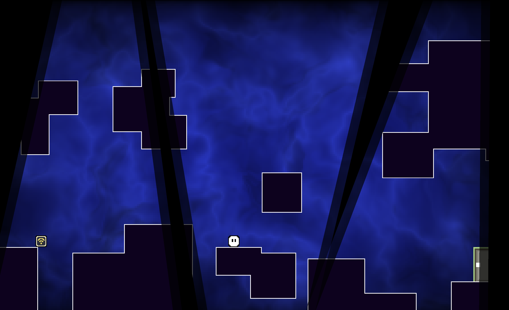

## Work Log

### March 10 - Project Setup

The project started as a clean Godot 4 workspace with a basic folder structure:
`features`, `levels`, `assets`, `ui`, `docs`, and `addons`. That early structure
made later systems easier to separate. Player code stayed in player files,
level logic stayed in level files, and reusable mechanics gradually moved into
their own feature folders.

Main files from this stage:

| File | Purpose |
| --- | --- |
| [project.godot](../project.godot) | Godot project settings, input actions, and autoloads. |
| [.gitignore](../.gitignore) | Keeps generated Godot files and local clutter out of commits. |

### March 15-16 - Player Feel

The first real task was making the character feel good. The player started as a
simple `CharacterBody2D`, then gained a proper movement script, sprite,
tilemap test room, and separate squash/stretch component.

By the end of this pass the controller had:

| Feature | Why it matters |
| --- | --- |
| Coyote time and jump buffering | Makes jumps feel fair even when the input is a little early or late. |
| Variable jump height | Lets the player control jump commitment. |
| Apex hang | Gives jumps a small readable pause at the top. |
| Dash | Adds speed and expressive movement. |
| Wall slide and wall jump | Turns vertical surfaces into routes. |
| Double jump and slow fall | Opens up later ability and level design options. |

Useful files:
[player_movement.gd](../features/player/player_movement.gd),
[player_abilities.gd](../features/player/player_abilities.gd),
[player_squash_stretch.gd](../features/player/player_squash_stretch.gd).

### March 18 - Feedback and Transitions

Once movement worked, the game needed to feel less silent and static. Dash
received a trail effect, player actions started emitting SFX events, and the
first version of the circular transition was added.

The transition started as a respawn experiment, but it became a general scene
change tool later. That was a good direction: it gives death, restart, level
entry, and level exit the same visual language.

Useful files:
[trail_effect.gd](../features/effects/trail_effect.gd),
[player_sfx_controller.gd](../features/audio/player_sfx_controller.gd),
[circle_transition.gd](../features/transition/circle_transition.gd).

### March 19 - Light Becomes the Main Mechanic

This is where the project found its shape. `DarkManager` added the global
darkness, and `LightZone` turned polygons into both visible cutouts and gameplay
areas.

The important part is that light was not treated as decoration. The player and
objects started tracking whether they were inside light, and that state could
change collision, interaction, danger, and puzzle logic.

Useful files:
[dark_manager.gd](../features/darkmanager/dark_manager.gd),
[light_zone.gd](../features/lightzone/light_zone.gd),
[light_reactive.gd](../features/shared/light_reactive.gd).

### April 3 - From Prototype to Level Structure

The next big step was turning isolated tests into something closer to a game.
Doors became checkpoints and exits, switches could control scene targets, and a
base level script began handling repeated setup like transitions, background
state, music, pause menu creation, and level completion.

This is also when the first set of demo rooms appeared. They were later moved
into `levels/chapter_1`, but this pass made it possible to build levels around
shared rules instead of one-off scene hacks.

Useful files:
[base_level.gd](../levels/base_level/base_level.gd),
[door.gd](../features/door/door.gd),
[switch.gd](../features/switch/switch.gd),
[interact_prompt.gd](../features/interact_prompt/interact_prompt.gd).

### May 2-3 - Puzzle Objects, Audio, and Menus

The May work was the biggest jump in quality. The light mechanic gained objects
that could carry it, redirect it, or respond to it:

| Object | Gameplay role |
| --- | --- |
| Battery | Recharges in light, can be absorbed, and carries a temporary light zone into darkness. |
| Flashlight | Can be absorbed, moved around, and rotated to aim light into a room. |
| Button box | Turns light exposure into a trigger signal. |
| Switch | Lets the player turn target light sections on or off, changing which parts of the room are usable. |
| Hazard | Kills only when the player is in light, keeping darkness mechanically meaningful. |

At the same time, the game gained proper music handling, Music/SFX buses, UI
sounds, and menu screens. The level selector reads from `LevelManager.LEVELS`,
draws the chapter graph, and saves progress. The pause menu uses the same pixel
UI language and stores audio settings through the level manager.

The pickup system made the light props more interesting than static level
objects. When the player absorbs a battery or flashlight, the object keeps its
own behavior while being carried. After it is dropped, it returns to the level as
a solid puzzle object, so it can still block, support, light, or redirect the
player's route.

Useful files:
[battery_light.gd](../features/battery_light/battery_light.gd),
[flashlight_box.gd](../features/flashlight_box/flashlight_box.gd),
[button_box.gd](../features/button_box/button_box.gd),
[hazard.gd](../features/hazard/hazard.gd),
[level_manager.gd](../features/level_manager/level_manager.gd),
[level_selector.gd](../ui/level_selector/level_selector.gd),
[pause_menu.gd](../ui/pause_menu/pause_menu.gd),
[music_manager.gd](../features/audio/music_manager.gd).

### May 4 - Chapter 1 Pass

The latest major pass finished Chapter 1 as a playable chain of rooms. Levels
8-11 were added, earlier rooms were refined, pickup prompts were improved, and
the selector graph was updated for the expanded route.

At this point Light Bender had moved beyond "test scene with a mechanic". It had
a first chapter, a menu flow, saved progress, sound, transitions, and enough
light-based objects to build real puzzles.

## File Index

| If you want to inspect... | Open |
| --- | --- |
| Player movement | [features/player/player_movement.gd](../features/player/player_movement.gd) |
| Pickup and carrying | [features/player/player_pickup_controller.gd](../features/player/player_pickup_controller.gd) |
| Light zone geometry | [features/lightzone/light_zone.gd](../features/lightzone/light_zone.gd) |
| Light-gated interaction | [features/shared/light_reactive.gd](../features/shared/light_reactive.gd) |
| Batteries | [features/battery_light/battery_light.gd](../features/battery_light/battery_light.gd) |
| Flashlights | [features/flashlight_box/flashlight_box.gd](../features/flashlight_box/flashlight_box.gd) |
| Doors and checkpoints | [features/door/door.gd](../features/door/door.gd) |
| Level completion and saves | [features/level_manager/level_manager.gd](../features/level_manager/level_manager.gd) |
| Level selector | [ui/level_selector/level_selector.gd](../ui/level_selector/level_selector.gd) |
| Pause menu | [ui/pause_menu/pause_menu.gd](../ui/pause_menu/pause_menu.gd) |
